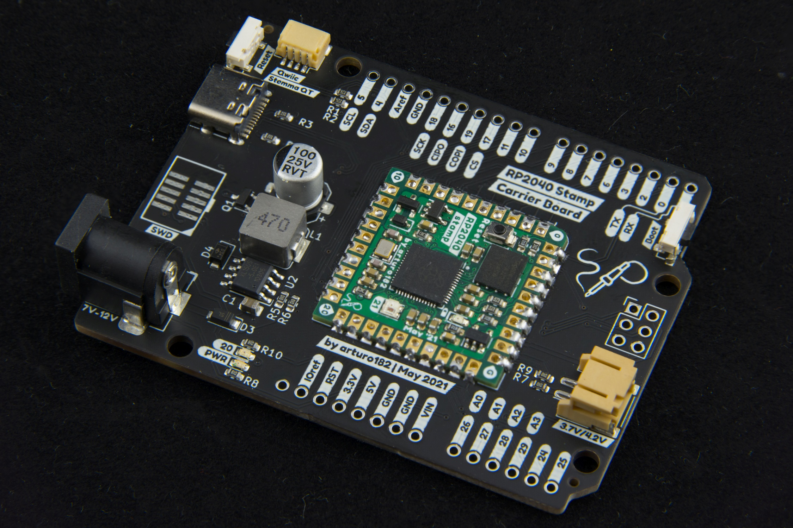

# The RP2040 Stamp Carrier

The RP2040 Stamp Carrier is a Uno form-factor reference design for the RP2040 Stamp. 
The HW files for the Stamp can be found here: https://github.com/solderparty/rp2040_stamp_hw

The Carrier uses a combo SMT/TH Stamp footprint, the Stamp can be soldered directly to the Carrier, 
or you can use 2mm pin socket on the Carrier and 2mm pin header on the Stamp so the Stamp can be plugged in and out, and moved between different carriers.

On top of all the functionality of the Stamp, the Carrier also adds:
* USB Type-C connector
* Boot button
* Qwiic connector
* SWD header
* DC Jack (7-12V)
* LiPo connector (3.7/4.2V)
* Power LED
* User LED

# Links

For more information visit https://rp2040-stamp.solder.party/